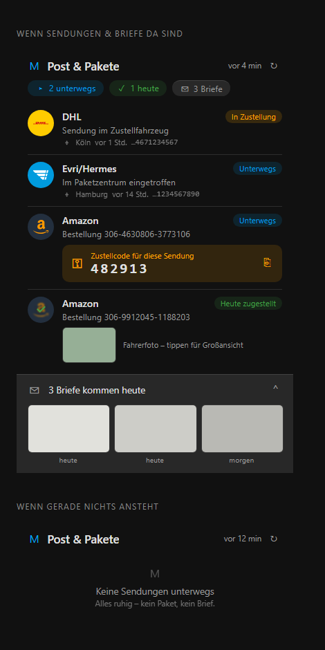

# Mail and Packages Card

A modern shipment-list card for the [Mail and Packages](https://github.com/BMWfan/Home-Assistant-Mail-And-Packages) integration.



*One card, two states: with shipments and letters (top) and when nothing is pending (bottom). Gray boxes are placeholder images — live they show the actual letter scans and driver photo.*

Instead of a grid of per-carrier counters, the card shows what actually matters:

- **Shipment list** – one row per shipment with carrier badge, status chip, last tracking event, location and time (powered by the integration's universal tracking / 17track data). Tap a row to open the carrier's tracking page.
- **Summary chips** – packages in transit, delivered today, letters arriving.
- **Amazon delivery codes (OTP)** – shown attached to the matching order, with one-tap copy.
- **Amazon Hub pickup codes**.
- **Driver photo** – thumbnail on the delivered row, tap to enlarge.
- **Letter previews** – expandable row with per-letter images (DHL Briefankündigung) and delivery dates.
- **Scan now** button in the header + relative "last checked" time.
- Clean empty state, automatic dark/light theme support, German + English.

## Zero configuration

All entities are discovered automatically from the entity registry (integration platform `mail_and_packages`). Add the card and you are done:

```yaml
type: custom:mail-and-packages-card
```

### Options

| Option | Default | Description |
| --- | --- | --- |
| `name` | `Post & Pakete` / `Mail & Packages` | Card title |
| `show_summary` | `true` | Summary chips row |
| `show_shipments` | `true` | Shipment list |
| `show_letters` | `true` | Letters row |
| `letters_expanded` | `false` | Expand letter previews by default |

Entity auto-discovery can be overridden per key if ever needed
(`updated`, `universal`, `transit`, `delivered`, `letters`, `amazon`,
`amazon_delivered`, `otp`, `hub`, `scan`, `amazon_camera`, `dhl_camera`):

```yaml
type: custom:mail-and-packages-card
universal: sensor.my_renamed_universal_sensor
```

## Install

### HACS

- Add `https://github.com/BMWfan/Home-Assistant-Mail-And-Packages-Custom-Card` as a custom repository (type **Dashboard**)
- Install "Mail and Packages Custom Card"
- Hard-refresh the browser after updates (Ctrl+Shift+R)

### Manual

Copy `dist/Home-Assistant-Mail-And-Packages-Custom-Card.js` to `config/www/` and add it as a dashboard resource:

```
url: /local/Home-Assistant-Mail-And-Packages-Custom-Card.js
type: module
```

## Requirements

Requires the Mail and Packages integration **v0.6.0 or newer** (letter image URLs and OTP order mapping in sensor attributes).
