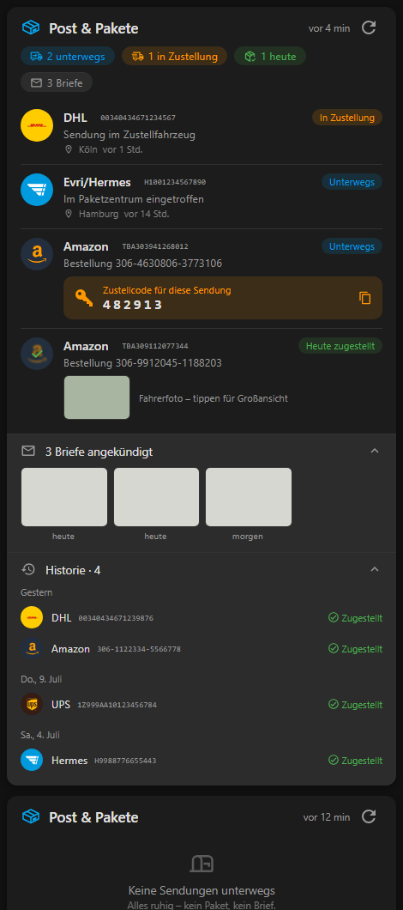

# Mail and Packages Card

Eine moderne Sendungslisten-Karte für die [Mail and Packages](https://github.com/BMWfan/Home-Assistant-Mail-And-Packages) Integration.



- **Sendungsliste** mit Paketdienst-Badge, Status, letztem Tracking-Ereignis, Ort und Zeit; Tippen öffnet die Sendungsverfolgung des Paketdienstes.
- **Zusammenfassung**: Pakete unterwegs, heute zugestellt, Briefe erwartet.
- **Amazon-Zustellcodes (OTP)** und **Amazon-Hub-Abholcodes** mit Ein-Tipp-Kopieren.
- **Fahrerfoto** bei zugestellten Sendungen.
- **Briefvorschau** mit Bildern pro Brief und Zustelldatum.
- Button „Jetzt prüfen", dunkles/helles Theme, Deutsch + Englisch.

## Keine Konfiguration nötig

Alle Entitäten werden automatisch aus der Entity-Registry erkannt (Plattform `mail_and_packages`):

```yaml
type: custom:mail-and-packages-card
```

## Installation

Ressource einbinden (bei HACS automatisch), danach Browser hart neu laden (Strg+Umschalt+R):

```
url: /local/Home-Assistant-Mail-And-Packages-Custom-Card.js
type: module
```

Voraussetzung: Mail and Packages Integration **v0.6.0 oder neuer**. Details und Optionen: siehe README.
